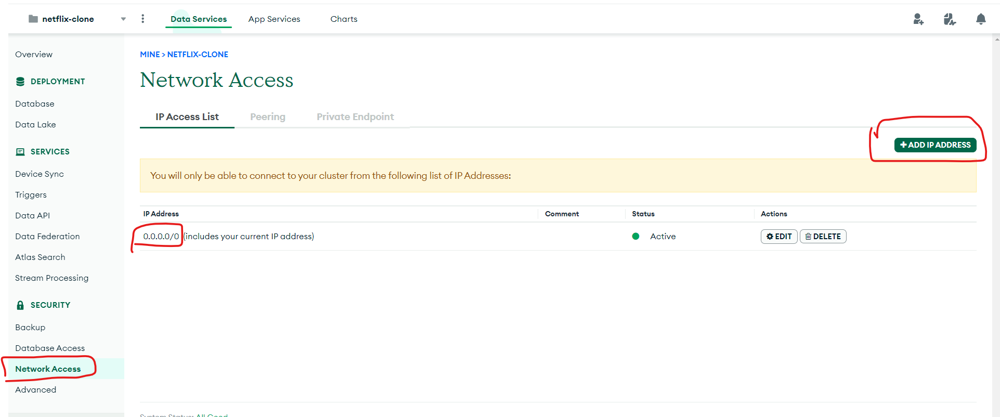

# Netflix Clone in React, Tailwind CSS, Next.JS, Prisma, MongoDB, NextAuth

## Problem connecting to a mango db Instance ?

- cmd : $ npx prisma db push

- Error : Environment variables loaded from .env
  Prisma schema loaded from prisma\schema.prisma
  Datasource "db": MongoDB database "movies" at "cluster0.xrsae9e.mongodb.net"
  Error: MongoDB error
  Kind: Server selection timeout: No available servers. Topology: { Type: ReplicaSetNoPrimary, Set Name: atlas-bk8a2c-shard-0, Servers: [ { Address: ac-zvcqurn-shard-00-00.xrsae9e.mongodb.net:27017, Type: Unknown, Error: Kind: I/O error: received fatal alert: InternalError, labels: {} }, { Address: ac-zvcqurn-shard-00-02.xrsae9e.mongodb.net:27017, Type: Unknown, Error: Kind: I/O error: received fatal alert: InternalError, labels: {} }, { Address: ac-zvcqurn-shard-00-01.xrsae9e.mongodb.net:27017, Type: Unknown, Error: Kind: I/O error: received fatal alert: InternalError, labels: {} } ] }, labels: {}
  0: schema_core::commands::schema_push::Calculate `from`
  at schema-engine\core\src\commands\schema_push.rs:29
  1: schema_core::state::SchemaPush
  at schema-engine\core\src\state.rs:436

- Solution : Allow cnx from any Ip Address
  
